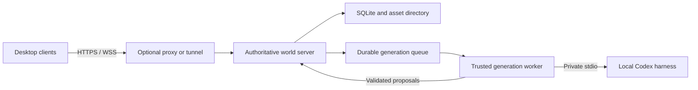

# Infinite Pokémon: Multiplayer Architecture

Implementation status: the multiplayer prototype is built and tested. This design document includes prospective decisions; consult [docs/IMPLEMENTATION.md](docs/IMPLEMENTATION.md) for the implemented `ws` transport, operating instructions, and current limitations.

Admission revision: **Single player** and **Multiplayer** replace the previous title flow. Multiplayer contains **Host session** and **Join session**. Players do not create game accounts, exchange invitation codes, or manage recovery keys. A local owner connects Codex when needed; guests join an enabled session by IP/URL. Browser tokens remain internal save/ownership identifiers.

Finite preview exception: Single player's **Play tutorial preview** opens a private five-map prepared save without a harness or generation. It cannot admit multiplayer guests or allocate new maps. Real verification can promote the same save to full play, preserving progress; the normal full-play and hosting gates then apply.

Proposed implementation architecture, expanding `TECHNICAL_ARCHITECTURE.md`. Capacity, latency, and recovery targets require measurement.

## 1. Scope and deployment model

The first playable targets 2–8 connected players sharing a persistent world. Players explore together or independently, influence shared quests, complete personal tutorials, and join one bounded cooperative battle. Individual encounters and private trainer battles remain available. PvP and trading are outside this release.

One authoritative Node.js/TypeScript server owns each world. The desktop application runs rendering, menus, host harness onboarding, and input handling. Single player uses this same server with public admission disabled, so combat, persistence, and generation follow the multiplayer code path. This admission policy is distinct from the loopback binding of the private administration listener.

The host can run the server on their desktop or a home machine. Internet hosting adds routing to this same package; it does not require a centrally operated world service. A host shutdown makes that world unavailable until its server returns. Automatic host migration is not part of the first release.

## 2. Authority, sessions, and synchronization

Colyseus is the proposed transport framework. Its documented model lets clients request changes while the server mutates synchronized room state. This removes some replication work, but durable persistence, command validation, and narrative conflict resolution remain application responsibilities. [Colyseus state synchronization](https://docs.colyseus.io/state)

Begin with one `WorldRoom` for each active hosted world. Map changes update subscriptions within that session rather than requiring a reconnect. Publish nearby presence and relevant NPC changes; do not broadcast every visited map or private player record. Battle sessions are server domain objects with participant-only projections. Use framework-supported filtered state or explicitly addressed messages, and test their privacy boundaries.

Clients send commands containing protocol version, session identity, command ID, sequence number, action type, and expected relevant revision. The authenticated connection supplies player identity; a payload cannot select another player. The server validates ownership, position, action prerequisites, and limits before applying a command. Responses include the command ID and resulting revision. Durable actions use unique operation keys so retries cannot duplicate captures or rewards.

Movement uses a fixed simulation step, interpolation, and bounded prediction. The server validates traversal and collision, and decides battles, inventory changes, encounters, and quest outcomes. Client clocks never establish authority. A handshake rejects incompatible protocols with an update message.

Colyseus reconnection can reserve a dropped client's seat, but it cannot replace durable game recovery. Pin compatible framework versions and verify the selected release's lifecycle behavior. [Colyseus reconnection](https://docs.colyseus.io/room/reconnection)

## 3. World, party, and player state

World state contains committed geography, exits, public NPC identities, shared story facts, and consequential events. Party state contains membership, active cooperative objectives, and party-specific branch decisions. Player state contains creatures, inventory, tutorial progress, personal relationships, and private quest knowledge. A projection explicitly chooses which facts each recipient may receive.

Public NPC facts cannot contradict themselves between players. Player-specific dialogue can reflect private knowledge without changing the NPC's canonical identity. Shared mutations carry preconditions and execute in server order. If two requests conflict, one permitted transition commits; the other receives the current outcome. Party branches requiring consensus use a bounded vote with a declared tie rule.

Tutorial progress remains personal. Only the opening lesson belongs to the spawn map. Subsequent lessons attach to suitable guide locations along whichever route each player takes. Guide interactions and lesson dialogue can be private even when their visual anchor is shared. Completion and rewards use `(playerId, lessonId)` uniqueness. A veteran entering beside a beginner cannot skip the beginner's lesson or reopen their own rewards.

Individual battles affect their participants only. The bounded cooperative encounter accepts an explicit party roster, takes one action per participant per round, and computes the round on the server. Completed turns are persisted. Rewards commit once per eligible participant. Timeout behavior is stated before joining: a disconnected participant defends while the remaining party continues after the reconnect grace period.

## 4. Harness connection and generation workers

Only the local owner connects a harness. When no valid verified connection exists, the owner authenticates their CLI, grants token-use consent, and completes skill/context verification. A verified connection can be reused when enabling multiplayer in the same world. Generation consumes the owner's authorized provider allowance. Guests join by IP/URL with an automatically issued internal session and no game-account form, invitation, CLI, provider account, or token-spending agreement.

Internal world-session identity is separate from harness authentication. A trainer nickname is optional character metadata, not an account. The server accepts worker health through its trusted probe flow; a self-reported flag is not proof of provider authentication. Provider credentials remain local and never appear in gameplay messages or context bundles.

Only host-approved generation workers receive jobs and spend the authorized budget. The default worker runs with the host and communicates with Codex through private stdio. Its environment has the installed generation skill and a dedicated workspace, not arbitrary user directories.

A trusted remote worker may connect outward to retrieve scoped snapshots and submit proposals. Job payloads contain data, dependency versions, and output contracts. They cannot supply executable skills, shell commands, or plugins. Workers use a locally installed, versioned skill selected from an allowlist. Public reverse proxies never expose Codex app-server, worker administration, or filesystem APIs.

## 5. Consistent generation ahead of players

The server maintains a durable queue across all active frontiers. Priorities combine exit proximity, destination readiness, generation latency, and per-player fairness. Five initial maps remain useful, but diverging players require a larger adaptive buffer and a bounded concurrency budget. Complete fallback maps cover generation delays; once revealed, their geography becomes persistent.

Each job receives an immutable local-file snapshot containing committed story facts, relevant map histories, NPC identities, player/party progression, neighboring exits, and unresolved plot obligations. Unvisited plans are marked separately from events that happened. Snapshot metadata records world ID, job ID, seed, schema and skill versions, and relevant dependency revisions.

A unique key for `(worldId, destinationId, generationKind)` deduplicates requests. A worker claims a time-limited lease with a monotonically increasing fencing token. Submission must match the current lease/token, so an expired worker cannot overwrite its replacement. A stable commit key also protects against retry after an acknowledgment is lost.

Workers produce proposals in staging. The server checks schemas, walkability, reciprocal exits, asset references, narrative preconditions, and dependency revisions. An unrelated distant action need not invalidate output; changing a referenced NPC or entrance does. Conflicting proposals are rejected or regenerated against a fresh snapshot.

Publication writes verified immutable assets first, then atomically commits the manifest, references, and story changes in SQLite. A crash can leave removable unreferenced assets but cannot expose a committed manifest with unfinished dependencies. Revealed maps change only through explicit recorded events or overlays. Generated data never becomes arbitrary executable gameplay code.

## 6. Server storage and delivery

SQLite stores player saves, world events, map manifests, job leases, revisions, and reward receipts. Assets live in a content-addressed directory on the server. Use WAL on local disk, serialize writes, and keep transactions short. Clients access neither database files nor network filesystem shares. SQLite documents that WAL readers and writers must run on the same host; WAL is unsuitable for a shared network database file. [SQLite WAL](https://www.sqlite.org/wal.html)

Serve authorized manifests and immutable asset URLs over HTTP; stream gameplay changes through WebSocket. Clients verify asset hashes and retain disposable caches. A hash detects mismatched bytes, but does not establish authorization. Private manifests require access checks, and unrevealed narrative details stay server-side.

Backups pair a consistent SQLite backup with every asset referenced by that snapshot and a versioned world manifest. Never copy only a live database file while ignoring its journal state. Retention preserves referenced assets until all dependent backups expire. Restore tests must recover maps, story facts, inventory, tutorial progress, and in-flight job state onto a separate server instance.

Disk quotas pause speculative generation before storage is exhausted. The server reports capacity problems and retains existing content. “Infinite” means continued generation within available compute and storage, not unlimited physical capacity.

## 7. Single player, hosting, and joining

**Single player** verifies the owner's harness when necessary, disables public admission, prepares/resumes the save, and enters automatically. **Multiplayer → Host session** uses the same world and verified connection, enables guest admission, and displays its IP/URL. **Multiplayer → Join session** accepts that address and joins without a game-account or invitation step. Guests never enter harness onboarding. Internal browser tokens resume server saves without a recovery-key interface.

Slow provider jobs use prepared destinations and local fallbacks. If the worker stops or its authentication fails during play, the running server advertises degraded generation, notifies the host, and continues serving existing players with prepared content and complete fallbacks. New guest admissions pause until the host restores verified generation capacity; existing players may reconnect. Restarting a stopped world requires host verification again. A stopped server cannot serve play. Guest connection issues never pause the world.

LAN hosting binds to the intended private interface and uses a documented firewall rule. Public hosting can terminate HTTPS/WSS at Caddy and proxy to a loopback server. Public certificate issuance requires suitable DNS and reachability; a reverse proxy alone cannot bypass CGNAT. [Caddy reverse-proxy guide](https://caddyserver.com/docs/quick-starts/reverse-proxy)

An optional outbound tunnel supports homes without inbound port forwarding. It introduces a relay dependency while leaving world storage on the host. Tunnel credentials stay with the operator, and only game routes are published. [Cloudflare Tunnel](https://developers.cloudflare.com/tunnel/)

On disconnect, stop accepting player input, mark presence accordingly, and hold a bounded reconnect reservation. Other players continue. Reconnection returns authoritative state and command outcomes rather than blindly replaying stale inputs. Server restart reconstructs durable sessions and invalidates transient tokens when necessary. Lost generation leases expire and requeue safely.

## 8. Development checks

The first playable must demonstrate these failure cases with automated integration checks and a two-client visual walkthrough:

1. Simultaneous entry into one frontier produces one canonical map and matching exits.
2. Eight diverging clients with deliberately slow generation retain bounded queues, fair scheduling, and playable fallback destinations.
3. Conflicting NPC choices yield one consistent outcome used by subsequent generation.
4. Beginners and veterans sharing a cached map retain independent lesson progress and unique rewards.
5. A disconnect after capture commit but before acknowledgment cannot duplicate creatures or item consumption.
6. Process termination during publication or a battle transaction restores a complete prior or committed state.
7. Expired-worker output and stale dependencies cannot overwrite newer content.
8. Proxy interruption recovers sessions without executing duplicate actions.
9. Unauthorized clients cannot read private battle state, worker routes, or provider credentials.
10. A backup restores on another machine, and the cooperative encounter completes with one participant disconnecting and returning.
11. Guests without a CLI can join an enabled full session; absent owner verification blocks generated play/hosting. The explicit finite preview makes no model calls and cannot admit guests or expand. Worker failure applies the documented degraded full-session policy.

Record map readiness, generation latency and tokens, rejection causes, reconnect outcomes, and recovery for debugging. Paper work is deferred until real experiments are completed; these game-development checks are not research results.
