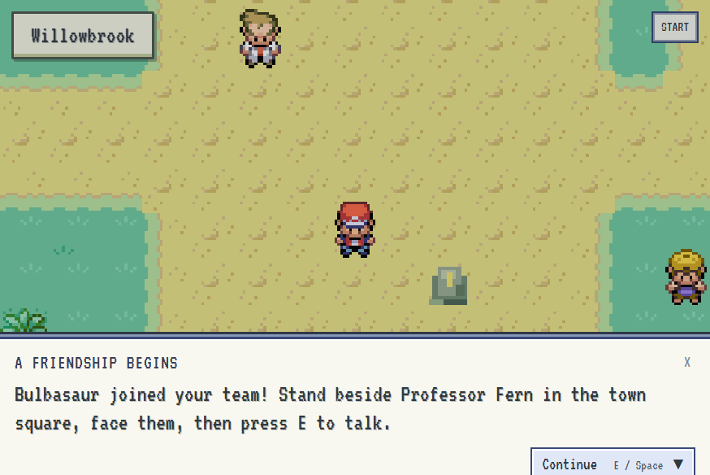
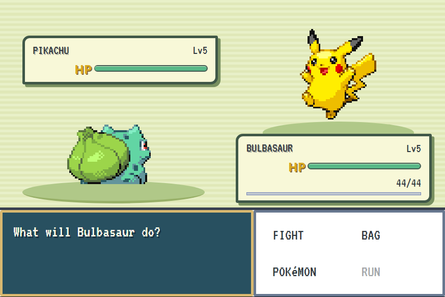
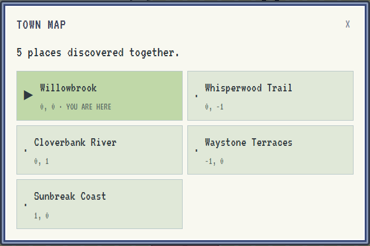

# Infinite Pokémon（无限宝可梦）

[官网与浏览器演示](https://infinite-pokemon-blond.vercel.app) 已迁至独立仓库 `Shellishack/infinite-pokemon-website`。本仓库使用 Vite 构建本地／Electron 游戏，入口为 `/game/`（根路径保留兼容入口）。官网部署与游戏发布相互独立。

[English](README.md) | **简体中文** · [官网与浏览器试玩版](https://infinite-pokemon-blond.vercel.app/) · [Discord 社区](https://discord.gg/kKbY8xaVxG) · [GitHub 仓库](https://github.com/Shellishack/infinite-pokemon) · [技能下载](https://github.com/Shellishack/infinite-pokemon/releases/tag/skills-v0.2.0) · [技术报告 v0.4（PDF，暂定稿）](docs/technical-report/Infinite-Pokemon-Technical-Report-v0.4.pdf)

## 从这里开始

```sh
npx skills add Shellishack/infinite-pokemon --skill infinite-pokemon
```

然后告诉 Codex（或兼容的 AI 助手）：**“使用 $infinite-pokemon，帮我配置并启动游戏。”** 入口技能会克隆缺失的游戏文件、检查环境、安装依赖、构建并启动游戏。

安装技能本身不会启动软件。Skills CLI 需要仓库来源，单独的 `npx skills add infinite-pokemon` 不是受支持的全局别名。详见[入口技能](skills/infinite-pokemon/SKILL.md)。


**冒险，永不落幕。**

[试玩浏览器版](https://infinite-pokemon-blond.vercel.app/game/) · [从源码运行](#在电脑上运行) · [查看技能](#下载技能)


*35 秒了解核心循环：游玩、记录经历，再让 Codex 为接下来的冒险提出内容。*

Infinite Pokémon 探索一个想法：游戏世界能否随着你的游玩不断续写？当你走向新的区域，本地 AI 执行环境会读取当前存档的经历，为新的地点、角色、对话和剧情线索提出方案；当你回到旧地点，那里仍保留在同一个世界中。

这是一个使用 TypeScript 开发、具有经典宝可梦像素风格的可玩原型。目标是让冒险持续延伸，同时保持操作和规则可靠。“无限”代表设计愿景，并不意味着已经实现无限的内容质量、长期剧情一致性或零等待体验。生成时间、存储、模型额度以及引擎支持的内容类型仍然存在限制。

## 游戏展示

| 探索持续存在的世界 | 战斗并收服伙伴 |
| --- | --- |
|  |  |

| 探索有陈设的室内空间 | 回到一个记得你的世界 |
| --- | --- |
|  |  |

无需安装的浏览器试玩版包含五个预制区域、战斗、收服、室内场景和本地自动存档。完整游戏会连接本地 Codex，让世界继续生长。多人模式允许朋友共享主机的世界，只有主机需要提供生成额度。

> **仅供教育与非商业用途。** 本项目是实验性的爱好者作品，并非官方宝可梦产品，与 Nintendo、Creatures、GAME FREAK 或 The Pokémon Company 无关联，也未获得其背书。
>
> **由 Codex 生成。** 人类提供大致的想法，OpenAI Codex 据此生成项目代码、文档和开发工具。引入的第三方依赖与参考素材并非 Codex 原创，其所有权及许可条款仍然适用。详见[免责声明](DISCLAIMER.md)与[素材来源](game/assets/classic/CREDITS.md)。四个独立技能指令包获准采用 MIT-0，具体范围见下文。

## 下载技能

入口技能和三个生成技能已发布到以下平台：

| 平台 | 快速启动技能 | 四个技能 |
| --- | --- | --- |
| **skills.sh** | [infinite-pokemon](https://skills.sh/shellishack/infinite-pokemon/infinite-pokemon) | [地图](https://skills.sh/shellishack/infinite-pokemon/infinite-pokemon-region) · [NPC](https://skills.sh/shellishack/infinite-pokemon/infinite-pokemon-npc) · [室内](https://skills.sh/shellishack/infinite-pokemon/infinite-pokemon-interior) |
| **ClawHub** | [Infinite Pokémon Quick Start](https://clawhub.ai/shellishack/skills/infinite-pokemon) | [地图](https://clawhub.ai/shellishack/skills/infinite-pokemon-region) · [NPC](https://clawhub.ai/shellishack/skills/infinite-pokemon-npc) · [室内](https://clawhub.ai/shellishack/skills/infinite-pokemon-interior) |
| **skills.re** | [infinite-pokemon](https://skills.re/skills/Shellishack/infinite-pokemon/infinite-pokemon) | [地图](https://skills.re/skills/Shellishack/infinite-pokemon/infinite-pokemon-region) · [NPC](https://skills.re/skills/Shellishack/infinite-pokemon/infinite-pokemon-npc) · [室内](https://skills.re/skills/Shellishack/infinite-pokemon/infinite-pokemon-interior) |
| **GitHub** | [入口技能源码](skills/infinite-pokemon/SKILL.md) | [v0.2.0 ZIP 下载](https://github.com/Shellishack/infinite-pokemon/releases/tag/skills-v0.2.0) |

[SkillsMP](https://skillsmp.com/search?q=infinite-pokemon) 也已按其文档要求，通过 GitHub Topics 提交自动收录，但目前尚未出现公开条目，因此暂时不能作为下载入口。详情见[发布状态与许可说明](docs/SKILL-DISTRIBUTION.md)。

## 世界如何继续生长

1. **规则由游戏引擎执行。** 服务端负责移动、碰撞、战斗、背包和进度。AI 不能仅凭一段文字发放奖励或宣布胜利。
2. **经历保存在当前游戏运行中。** 地图、选择、NPC 记忆和事件写入数据库，再导出供生成任务读取的本地快照。传给模型的是经过筛选的有限上下文，并非无限长度的完整历史。
3. **生成的是内容提案。** Codex 根据上下文返回结构化方案。通过数据格式、地图可达性和依赖一致性检查后，内容才能进入游戏。
4. **提前生成相邻区域。** 默认深度为 1，并发数为 3；已经准备好的地图会被复用。目的地未完成时会显示等待状态，可重试或取消。
5. **从存档选择另一个未来。** 可以保存检查点后继续，也可以从旧检查点创建分支。分支拥有独立的世界数据库和生成上下文，不会混入原分支之后发生的事件。

多人模式下，玩家共享同一游戏运行中的世界。只有房主连接 Codex，并承担生成消耗；其他存档和分支依然是独立世界。

## 当前功能与限制

| 方向 | 当前实现 | 尚待完善 |
| --- | --- | --- |
| 世界生成 | 持久化模板地图、生成的名称、描述、对话、剧情线索和有限地形特征 | 更自由的地形与建筑几何 |
| 连贯性 | 存档内事件、NPC 记忆、邻接地形信息和过期提案检查 | 长期叙事一致性评估、强制渐变地形 |
| NPC | 性格、对话、有限意图与可选静止／游走／巡逻策略 | 更丰富且可验证的自主行为 |
| 室内 | 在固定房间内生成家具、地毯、名称和可查看的描述 | 自由修改房间外壳与建筑结构 |
| 收集与经济 | 额外物种、生成档案、特征、杂交蛋、商店、货币与载具 | 更丰富的机制与平衡性 |
| 区域挑战 | 路线训练家、个人教程、合作守护者战斗 | 多地图区域注册、道场与大师系统 |
| 素材 | 已注明来源的经典参考素材，以及代码绘制的新内容 | 实时图像生成与素材导入流程 |

技能参考文档允许提出更广泛的创意，但**文档中的规划不等于运行时已经支持**。交易、完整社区中心、多地图区域身份、道场大师、任意建筑放置和外部生成图片导入目前尚未实现。

## 本地启动

需要 **Node.js 22.13 或更新版本**。进入仓库后运行：

支持 Node 22.13–22.15：缺少新版在线备份 API 时，会使用 SQLite 的 `VACUUM INTO` 创建备份。该兼容方式会在复制期间短暂阻塞服务端；较新的 Node 使用异步在线备份 API。桌面启动失败会显示服务端的实际错误，只有地址被占用时才提示端口冲突。

```sh
git clone https://github.com/Shellishack/infinite-pokemon.git
cd infinite-pokemon
npm install
npm run build
npm start
```

浏览器打开 [http://127.0.0.1:8788](http://127.0.0.1:8788)。Docker 不是本地游玩的必要依赖。

1. 选择 **Single player**（单人游戏）。
2. 尚未验证连接时，点击 **Connect to Codex**；该操作同时确认界面展示的 token 消耗说明。如有提示，完成 Codex 登录。
3. 验证成功后自动进入游戏，附近地图按设置在后台准备。地图尚未生成完成时，需要等待。

项目依赖中包含 Codex CLI **0.153.4**，无需另外全局安装。连接验证只发送一个随机标识和确认请求，不加载生成技能，也不要求读取文件。已验证的当前连接会复用；重新打开已经授权的游戏运行后，会自动检查登录并发送简短确认。模型服务的启动和响应时间仍然存在。

验证、后台生成以及失败的生成尝试都可能消耗 Codex 额度。普通界面不设置游戏级任务预算上限，仍受提供方额度与计费规则限制。昵称、生成并发数、生成深度和存档入口位于折叠的 **Optional settings**（可选设置）中。

开发模式：

```sh
npm run dev
```

Electron 桌面模式，先构建再启动：

```sh
npm run build
npm run desktop
```

直接以全屏启动：

```sh
npm run desktop:fullscreen
```

桌面窗口默认启动自己的服务端并选择可用端口；需要系统能找到 Node，或通过 `NODE_BINARY` 指定其绝对路径。这是从源码运行的桌面版本，尚非独立安装包。Node 内置 SQLite 可能显示实验性功能提示。

## 无需 Codex 的教程预览

选择 **Single player → Play tutorial preview** 即可体验五个已准备好的户外场景及其室内房间，不连接 Codex、不调用模型，也不生成新地图或故事。

| 方向 | 场景 | 特点 |
| --- | --- | --- |
| 中央 | Willowbrook | 小镇广场、花园、实验室与住宅 |
| 北方 | Whisperwood Trail | 森林小径、空地与护林员小屋 |
| 南方 | Cloverbank River | 草地、河流、木桥与休息屋 |
| 东方 | Sunbreak Coast | 海岸、水域、栈道与海岸站 |
| 西方 | Waystone Terraces | 石质阶地、遗迹与档案屋 |

中央区域有两个室内房间，其他区域各有一个。室内房间属于所在地图，不增加户外地图数量。第一课从出生点开始，之后的战斗、捕捉、照护和训练家课程跟随个人进度，而不是要求按特定方向行走；往返预览区域也能完成教程。

到达预览边界后，可以连接并验证 Codex，将**同一存档**继续为完整探索模式，保留伙伴、教程进度与已经见过的地图。预览存档与原始世界分开保存，可重启后继续；预览本身为私人模式，连接后才能开启多人。

## 多人游戏与操作

房主选择 **Multiplayer → Host session**，连接 Codex 后，在 **START → SESSION** 查看会话地址。也可以在单人运行中启用多人，共享同一存档。

访客选择 **Multiplayer → Join session**，输入房主的局域网地址（例如 `http://HOST_LAN_ADDRESS:8787`）或 HTTPS 地址。访客无需 Codex；昵称只是角色名称，不是账户。切回单人模式会断开访客连接并禁止新的公共加入，但保留服务端进度。

| 操作 | 按键或方式 |
| --- | --- |
| 移动 | 按住 WASD 或方向键 |
| 交互 | 与目标相邻并面向目标，按 E 或空格 |
| 进入房间 | 走入可见门口，或相邻面向门按 E |
| 游戏菜单 | Escape 或 START，再按 Escape 关闭 |
| 对话关闭 | Continue 按钮、E／空格或 Escape |
| 目标面板关闭 | 面板上的 Close 按钮 |
| 桌面全屏 | F11 或标题栏全屏按钮 |

对角线距离不算有效交互位置。NPC、围栏、墙和家具具有碰撞；草丛可能触发野生遭遇。室内照护者可治疗队伍，商人出售补给与自行车，托育者可让符合条件的伙伴产生杂交蛋。菜单中的 CODEX、NURSERY、RIDES 和 RECORDS 提供图鉴、育成、载具和统计入口。详见[收集、经济与育成说明](docs/VARIETY.md)。

浏览器在本地保存不透明的会话 token，以识别训练家并授权操作。清除访客浏览器数据，或改变主机名、协议、端口，可能丢失与原训练家的关联；目前没有手动恢复密钥界面。服务端最多允许 8 名同时在线训练家、64 份训练家档案；这些是实现限制，不代表完成了互联网大规模负载验证。

## 生成深度、并发与任务详情

深度以当前地图为中心，按照上下左右的邻接关系计算，不是镜头缩放或图形渲染距离。

| 深度 | 周围地图数 | 包含当前地图 |
| --- | --- | --- |
| 0 | 0 | 1 |
| 1（默认） | 4 | 5 |
| 2 | 12 | 13 |
| 3（上限） | 24 | 25 |

周围地图数为 `2 × d × (d + 1)`。队列优先处理离玩家较近的地图，已缓存的地图不会重复生成。多人分散探索时，会合并各自的范围，整体需求可能更大。

生成并发数默认 **3**，可设为 **1–8**。设为 1 表示顺序处理；并发是多项独立任务同时运行，并非一次提示生成多张地图。更大范围或并发可能带来更多 token 消耗，并不能保证完全消除等待。

左下角指示器展示正在生成和排队的地图。点击任务详情可查看模型、推理力度、已报告的 token 用量和工具执行状态；不展示模型的私有推理内容。尚未完成的目的地提供重试和取消，取消后不会在稍后完成时突然传送玩家。

## 存档、分支与完整重置

游戏自动保存当前进度，并提供默认游戏运行。**START → SAVES** 管理运行与检查点；SAVE 创建检查点，之后仍可沿当前运行继续。明确选择从旧检查点分支时，才创建独立世界，保留原运行后来的进展。

每个分支包含自己的地图、NPC 记忆、事件与生成上下文。检查点保存数据库状态，并不复制所有生成日志或 Codex 凭据。进行中的合作战斗会限制检查点创建，在线访客也会限制切换运行。详见[存档架构](docs/SAVES.md)。

首页 **Settings → Full game reset** 与存档切换不同。输入 `RESET` 后，会清除该游戏数据目录下所有运行、检查点、进度、生成内容和设置，并忘记游戏对 Codex 的授权；外部 Codex CLI 仍保持登录。不要把完整重置当作读取存档。

## 数据、配置与备份

`npm start` 默认写入 `./data`；Electron 默认写入应用用户数据目录下的 `world`。如需不同启动方式使用同一世界，将 `INFINITE_DATA_DIR` 设为同一个绝对路径，且不要让多个服务同时打开它。

| 环境变量 | 用途 |
| --- | --- |
| `INFINITE_DATA_DIR` | 数据库、上下文、生成内容与备份目录 |
| `PORT` | 访客端口，默认 8787 |
| `ADMIN_PORT` | 仅回环地址的管理端口，默认 8788 |
| `CODEX_EXECUTABLE` | 可选 Codex 可执行文件或 codex.js 路径，不接受 shell 包装脚本 |
| `CODEX_HOME` | Codex 身份与配置目录 |
| `NODE_BINARY` | Electron 启动服务端使用的 Node 路径 |
| `INFINITE_MAP_TIMEOUT_MS` | 单张地图生成超时，默认 180000 毫秒，上限 600000 |

`world.sqlite` 保存权威游戏状态。`context/snapshots/` 保存任务输入快照；各运行的 `generated-content/` 保存生成产物和诊断，不属于前端静态资源，并被 Git 忽略。旧版 `generation/` 日志保留在原位置。

**START → SESSION → World settings → Back up world** 可创建当前世界数据库的在线备份。完整归档应先正常停止服务，再复制整个数据目录，包括 `previews/` 和存档库。恢复时使用单独目录并保留原始备份；不要替换仍在运行的数据库或拆分活动 WAL 文件。Codex 身份凭据应单独保管，不应公开。

## 家庭服务器与可选 Docker

同一局域网内可使用房主的访客端口。公网部署需要可访问的网络入口及适当配置；[Caddy 示例](deploy/Caddyfile.example)用于反向代理，不自动解决 NAT 穿透。**不要公开管理端口或 Codex 凭据。**

[Dockerfile](Dockerfile)与[Compose 配置](compose.yaml)面向 Linux 家庭服务器，使用 host 网络；Windows/macOS 建议先使用原生 Node/Electron 启动方式。

```sh
docker compose build
docker compose up -d
docker compose exec game node node_modules/@openai/codex/bin/codex.js login --device-auth
```

持久化卷分别保存世界数据和私有 Codex 配置。停止容器会保留卷；需要保留世界时，不要运行 `docker compose down --volumes`。容器内认证、网络与沙箱仍需在目标 Linux 环境验证。预览升级后的会话可能使用独立端口，代理应指向实际访客端口。

## 技能与安装

四个独立技能包已按 **MIT-0** 授权，允许复用其中的指令文件。该例外不包含技能目录之外的游戏代码、素材或品牌内容；各包附带 LICENSE。游戏本身直接加载内置技能，游玩不需要额外执行安装命令。

| 技能 | 用途 |
| --- | --- |
| [infinite-pokemon](skills/infinite-pokemon/SKILL.md) | 按用户要求配置并启动游戏 |
| [infinite-pokemon-region](skills/infinite-pokemon-region/SKILL.md) | 根据存档上下文提出地图、地形与内容方案 |
| [infinite-pokemon-npc](skills/infinite-pokemon-npc/SKILL.md) | 对话、记忆、意图与可选移动策略 |
| [infinite-pokemon-interior](skills/infinite-pokemon-interior/SKILL.md) | 固定房间内的家具、地毯和描述 |

为兼容的执行环境单独安装：

```sh
npx skills add Shellishack/infinite-pokemon --skill infinite-pokemon-region --skill infinite-pokemon-npc --skill infinite-pokemon-interior
```

技能需要房主提供上下文和输出格式；安装技能并不等于安装完整游戏。见[技能说明](skills/README.md)、[版本化 ZIP 下载](https://github.com/Shellishack/infinite-pokemon/releases/tag/skills-v0.2.0)和[发布状态](docs/SKILL-DISTRIBUTION.md)。不同索引站的同步与审核可能尚未完成。

## 音乐与音效

项目包含 **12 段原创合成配乐**和 **22 种合成音效**，覆盖标题、探索、城镇、森林、海岸、遗迹、商店、战斗、治疗、捕捉、存档等场景。首次按键或点击后启用播放；音乐与音效分别支持静音、音量调整，窗口隐藏时暂停。播放不消耗 Codex 额度。

```sh
npm run audio:compose
npm run audio:sfx
npm run audio:all
```

这些命令通过 TypeScript 本地合成音频，并非调用在线音乐模型。扩展方式见[音频开发指南](docs/AUDIO-DEVELOPMENT.md)。

## 源码结构

```text
desktop/           Electron 窗口、预加载桥接与桌面外壳
game/
  client/          React 菜单、Phaser 渲染、输入与音频
  engine/          游戏规则、战斗、地图编译、NPC 与经济系统
  server/          网络、Codex 任务、数据库、存档与会话
  shared/          类型、格式校验、碰撞辅助与通信约定
  assets/          静态素材、图标、音乐与音效
  content/         预先编写的教程内容
skills/            生成技能与参考文档
scripts/           TypeScript 素材和内容工具
tests/             单元与端到端测试
docs/              实现说明与开发文档
```

动态 `generated-content/` 位于各存档数据目录中，不在发布的静态素材目录下。引擎目前仍依赖服务端 Store，目录拆分不代表已经完成数据库接口解耦。

## 测试与反馈

```sh
npm test
npm run build
npm run test:movement
npm run test:gameplay
npm run test:preview
npm run test:saves
npm run test:streaming
npm run test:variety
npm run test:e2e
npm run test:desktop
```

确定性测试使用测试执行环境，避免调用模型；实际 Codex 验证属于单独授权的操作。测试结果是工程检查，不等于用户研究或长期体验保证。[实现说明](docs/IMPLEMENTATION.md)记录当前边界，[场景规则](docs/GENERATIVE-SCENES.md)说明 NPC 与室内约束，[地图准备机制](docs/STREAMING.md)说明生成队列。

欢迎在 [GitHub Issues](https://github.com/Shellishack/infinite-pokemon/issues)反馈问题、提出想法或讨论生成式玩法。
