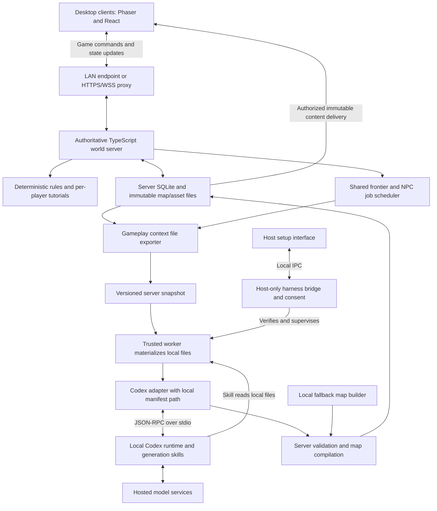

# Infinite Pokémon — technical architecture and implementation plan

Implementation status: a playable prototype now exists. This file preserves the design plan; [docs/IMPLEMENTATION.md](docs/IMPLEMENTATION.md) describes its actual scope and deviations.

Current admission revision: the title offers exactly **Single player** and **Multiplayer**. Multiplayer contains **Host session** and **Join session**. The previous three-option title, game-account/invitation flow, and recovery-key interface are superseded. Only the local owner connects Codex; guests join an enabled session by IP/URL. Internal browser tokens still associate saves and commands with a trainer. Earlier Colyseus, distributed-worker, and protocol proposals below remain historical design scope rather than implemented guarantees.

Explicit preview exception: **Single player → Play tutorial preview** opens five fixed tutorial maps in a separate save without Codex, model jobs, NPC planning, or map expansion. Lessons can finish through revisits. After real connection/consent/verification, that same preview save can continue into full exploration while its published maps remain stable. The connection gates below apply to full generated play and multiplayer hosting, not this finite private preview. See the game [implementation guide](docs/IMPLEMENTATION.md) for the implemented save and boundary behavior.

Draft: 2026-09-10. Project/repository name: `infinite-pokemon`. Player-facing name: **Infinite Pokémon**.

Revision: add server-authoritative multiplayer, server-owned maps and saves, and home hosting over LAN or internet. Only the host needs a local harness and token-use consent; guests join normally. Retain file-based gameplay context, the story introduction, and route-independent tutorials.

Build a cooperative multiplayer desktop RPG in TypeScript with a classic handheld Pokémon appearance: tile-based exploration, towns and routes, trainers, dialogue, creature collection, and turn-based battles. A self-hostable world server stores all canonical maps and player progress. Trusted local harness workers generate new places, characters, and connected story arcs while players explore. Single player uses the same server with public admission disabled.

The core decision is to build a deterministic game engine that consumes AI-authored content. Codex supplies map blueprints, NPC profiles, quest structures, encounter tables, and asset requests. Trusted TypeScript systems compile, validate, save, and execute that content. Gameplay never waits for a model response to resolve a movement step or battle turn.

The remaining design sections include capabilities beyond the built prototype. Consult the implementation guide for current behavior.

Detailed networking and deployment decisions are in [MULTIPLAYER_ARCHITECTURE.md](MULTIPLAYER_ARCHITECTURE.md). The initial multiplayer target is 2–8 cooperative players per world; supported behavior must be checked as the game develops.

## 1. Product behavior

1. The title offers **Single player** and **Multiplayer**. Single player connects and verifies the local owner's Codex when needed, then automatically enters the local adventure. Multiplayer opens **Host session** or **Join session**. Hosting uses the same owner connection and can enable sharing of the existing world. Joining asks for an IP/URL. Guests need no harness installation or provider account.
2. A real generation check verifies owner authentication, skill loading, local-file access, and structured output under explicit token-use consent. Starting a local adventure stays blocked until it succeeds. A still-valid verified connection is reused. Guests receive an internal game session automatically; there is no game account, invitation code, or recovery-key interface. An optional trainer nickname is a character field, not an account.
3. Creating a world prepares its premise, starter choices, starting map, and four adjacent maps: north/top, south/bottom, west/left, and east/right. These **five maps total** form the initial buffer. Initial preparation has visible progress.
4. After preparation, fade from the connection/preparation screen into a short story introduction, then fade into the starting map. The introduction uses the saved world premise and supports advance, replay, and reduced motion.
5. The starting map teaches movement, interaction, starter selection, and basic menus. This is the only tutorial fixed to a particular map.
6. Four subsequent guide lessons follow the player's global tutorial progress along their chosen route. Going south four times can complete the whole sequence; visiting all four starting neighbors is unnecessary. Lessons remain mandatory, occur in order, and advance only when their objectives are completed.
7. As the player approaches an exit, the game prioritizes destinations along that route. Every activated map can host the currently required lesson, whether it was prepared earlier, generated live, or assembled locally.
8. The server stores gameplay events, maps, player saves, NPC relationships, story facts, and tutorial progress. It exports local context snapshots for generation; a trusted worker reads those files through its skill before producing a continuation. Clients cache map assets but cannot replace server saves or canonical history.
9. Maps and decisions persist. Returning to a town restores its geography and residents, including previous actions. Once onboarding is complete, normal campaign progression proceeds without automatically assigning more beginner lessons.
10. Regional stories resolve into later arcs. The world can continue expanding without requiring one increasingly large model conversation.
11. Players join an enabled shared session through a LAN address or HTTPS endpoint. Single player disables public admission; hosting exposes the guest address while keeping administration and Codex private. Connected players can see each other, split up, and join a bounded cooperative encounter. Tutorials and beginner rewards remain individual; important world events are shared.
12. Anyone can run the same dedicated server package at home. A reverse proxy or optional outbound tunnel provides remote reachability while world files remain on the host's disk. Restarting the host or reconnecting clients loads the existing world.

Five prepared maps cannot guarantee uninterrupted AI generation at every exploration speed. Keep locally assembled fallback maps ready for slow, rejected, or unavailable content-generation jobs, subject to the connection gate below. A fallback is a complete playable location with consistent exits and required quest interactions. Once entered, it becomes permanent world content. AI novelty resumes in later unexplored locations.

The host must pass the connection gate before creating, starting, or restarting the world server's playable session; fallback content cannot bypass a failed initial verification. Once the server is running, a guest's network failure suspends only that player's input. The server owns battle timeout actions and committed progress. Worker failure is separate from game-server failure: reassign its lease if another host-approved worker is available, or continue prepared/fallback content for existing players and show degraded generation status. Allow reconnecting existing players; hold new admissions until the host restores worker readiness. Host controls and logs show whose generation account needs attention. Guests never receive a Codex login requirement. If every new map must be fully AI-generated, occasional waiting must be accepted; finite buffering cannot remove that tradeoff.

## 2. Recommended stack and process boundaries

| Layer | Choice | Responsibility |
|---|---|---|
| Language | TypeScript with strict checking | Shared contracts across client, server, generation, storage, and desktop integration |
| Desktop application | Electron | Local runtime discovery, window lifecycle, packaging, IPC, and process supervision |
| World rendering | Phaser | Tilemaps, camera, sprites, animation, input, and battle presentation |
| Interface | React | Harness connection and consent, story intro, tutorial prompts, save selection, party, inventory, dialogue, battle menus, and generation status |
| Build/workspace | Vite and pnpm workspaces | Renderer development and explicit package boundaries |
| Game rules | Pure TypeScript, executed authoritatively on the server | Movement legality, battles, encounters, progression, inventory, quests, and each player's tutorial director |
| World server | Node.js with Colyseus, plus HTTP content endpoints | Authoritative world/session state, interest-filtered synchronization, generation scheduling, validation, and persistence |
| Host bridge | Node-capable Electron utility process | Host harness verification, approved generation worker, and supervision of an embedded solo/home server |
| Generation worker | Node.js process beside the server or on the host's desktop | Reads server-exported local context files, invokes skills, and returns candidate bundles |
| Codex integration | Adapter around `codex app-server` over stdio | Login state, skill invocation, structured generation, streamed progress, cancellation |
| Validation | Zod plus JSON Schema and semantic validators | Parse external content and enforce game constraints |
| Storage | Server-local SQLite, context snapshots, and content-addressed files | All authoritative maps, saves, world history, jobs, and assets; clients keep disposable verified caches |
| Home hosting | Standalone server package; optional container, reverse proxy, or outbound tunnel | The same world runtime supports localhost, LAN, and authenticated internet sessions |
| Verification | Vitest, property-based checks, and desktop/browser automation | Rules, graph invariants, generation failure recovery, and playable flows |

Phaser provides an official React/TypeScript template and supports tilemaps built from arrays or Tiled data. Use our own versioned content contract and compile it into the renderer's representation. Pin compatible dependency versions after an initial packaging and tilemap experiment. [Phaser template](https://github.com/phaserjs/template-react-ts), [tilemap API](https://docs.phaser.io/api-documentation/namespace/tilemaps)



The world server is the sole game-state owner. React and Phaser send typed commands and render authorized projections; they cannot decide captures, rewards, NPC facts, or map publication. Clients may predict movement and reconcile against server sequence numbers. Keep one world room initially, with server-controlled visibility by map, party, player, and battle; changing maps does not require reconnecting. Colyseus supports server-authored state synchronization, while application code supplies durability, privacy rules, and transaction semantics. [Colyseus state synchronization](https://docs.colyseus.io/state)

Keep CPU-heavy map compilation, image processing, and validation in server worker threads so they cannot block command handling. Codex runs in trusted worker child processes and is awaited asynchronously. Electron main stays focused on window lifecycle and IPC; the dedicated server does not require Electron or an open desktop window. Electron utility processes remain useful for local services and are process boundaries, not automatic execution sandboxes. [Electron process model](https://www.electronjs.org/docs/latest/tutorial/process-model)

## 3. What AI generates and what the engine owns

| System | Codex generates | TypeScript enforces |
|---|---|---|
| Maps | Biome, points of interest, path intent, buildings, decoration, atmosphere | Tile placement rules, collisions, entrances, reachability, bounds |
| NPCs | Name, personality, role, dialogue, relationships, trainer theme | Stable identity, schedules from supported patterns, interaction commands |
| Story | Regional premise, quest branches, consequences, callbacks | Preconditions, objectives, reward limits, state transitions, canonical facts |
| Tutorials | Guide flavor and optional contextual dialogue | Ordered lessons, objective checks, placement, supplies, retries, one-time rewards |
| Creatures | Names, descriptions, visual briefs, bounded species proposals | Types, stat budgets, legal moves, progression, capture and combat rules |
| Battles | Trainer teams, encounter composition, narrative framing | Turn order, damage, statuses, rewards, deterministic randomness |
| Art | Requests and optional new sprite/portrait candidates | Palette, dimensions, anchors, frame layout, file validation, asset availability |

Runtime generation produces data with registered operation IDs, such as `startBattle`, `giveItem`, `setQuestFlag`, or `unlockExit`. Conditions and effects form a bounded declarative language. Server handlers validate permissions, ownership, scope, preconditions, and arguments. There is no generated JavaScript, `eval`, arbitrary HTML, shader, or shell command embedded in a map bundle. The server verifies command IDs and entity versions so retries cannot duplicate actions.

Start with established game mechanics and a small creature roster. Add new creature species through the same validation pipeline after the base battle system works. New content can introduce a fresh story or combination of mechanics without changing the engine during play.

## 4. Harness connection, consent, and introduction

The title offers **Single player** and **Multiplayer**, whose submenu contains **Host session** and **Join session**. Single player and Host connect the local owner's Codex only when a valid verified connection is unavailable. After consent, verification, and preparation, the player enters automatically. Join accepts the server IP/URL without a game login or invitation. Optional nicknames describe the trainer. Internal browser session tokens preserve command ownership and saves without becoming account UI. A host already playing alone can enable multiplayer for the same world and share its guest address.

Host disclosure: "Verification and background generation use your connected harness, consume tokens or account allowance, and may incur charges under your provider's plan." Explain that relevant shared gameplay context is sent through the host's worker to its model provider. Consent is unchecked initially and precedes any model-backed check or generation. The host controls account, job, concurrency, and usage limits. Guests see the server's shared-gameplay data disclosure at join, but no CLI verification or token-spending agreement. Guest machines and accounts never execute generation jobs in the initial design.

Persist consent locally with provider/account identity reference, disclosure version, timestamp, and chosen limits; store no credentials in that record. Reuse valid consent on reconnect for the same account and scope. Changing the account/provider or expanding the agreed usage scope requires renewed consent. Do not display a consent prompt for every map. Unknown token prices or allowances are shown as unavailable, with enforceable job/concurrency limits still applied.

```text
Title
  -> Single player: reuse verified Codex or connect -> consent/probe if needed
     -> public admission disabled -> prepare/resume world -> enter automatically
  -> Multiplayer
     -> Host session: reuse verified Codex or connect -> enable sharing -> show guest IP/URL
     -> Join session: server IP/URL -> enabled public session -> automatic internal session
  -> first player session: story intro -> personal spawn tutorial
  -> returning player: restore server save -> resume personal intro/tutorial/gameplay state
```

Check the host's worker readiness before opening a playable server session: live supported runtime, authenticated account, current consent, and a successful probe for this connection and skill version. A prior-launch success badge is insufficient. Failed checks preserve the server save and stay on host setup with a retryable cause. Worker reconnection repeats the small probe under valid consent; it does not regenerate the world. Guest reconnection uses the game session protocol only. For a headless server, the trusted owner enrolls a worker and verifies it through the same workflow; a worker's status is operational readiness, not a substitute for worker or game-session authentication.

The game uses a provider adapter so additional local harnesses could later implement authentication, file access, skill invocation, structured results, progress, and cancellation. This is an application design, not a claim that every harness supports an identical CLI protocol.

### 4.1 Codex adapter

The required installation is a **supported local Codex executable with an authenticated account**, accessible to the local bridge or trusted worker. Merely detecting a desktop application icon is insufficient. The bridge/worker supervises its own integration process; it does not automate the Codex desktop UI or depend on that window staying open. Keep app-server on private stdio. The public game proxy never forwards Codex RPC, shell, filesystem, or account-control methods. [Codex transports and integration](https://learn.chatgpt.com/docs/app-server)

Codex app-server exposes authentication, thread/turn APIs, skills, structured output, approvals, and agent events. Its default stdio transport suits a desktop child process. The official TypeScript SDK is also available for programmatic jobs; keep it as a possible alternate adapter if the integration experiment favors a smaller job-oriented surface. [App-server documentation](https://learn.chatgpt.com/docs/app-server), [TypeScript SDK](https://learn.chatgpt.com/docs/codex-sdk)

Proposed startup sequence:

1. Resolve a supported executable and inspect its version. Allow an explicit executable path for installations outside PATH.
2. Start an owned `codex app-server` child using stdio. Handle Windows launch shims as a platform-specific concern and verify paths in the packaging experiment.
3. Complete `initialize` and `initialized`; check supported protocol capabilities.
4. Read account state through `account/read`. When needed, launch the supported browser login through `account/login/start` and await completion.
5. Discover the bundled generation skill with `skills/list` and verify the expected path and skill version. Obtain the player's usage consent before the next step can consume model tokens.
6. Create a short-lived verification thread with a dedicated working directory and the minimum supported permissions. Place a tiny context fixture containing a fresh nonce in an allowed local file; the nonce is not included in the prompt.
7. Invoke the skill in verification mode with the fixture path and a small `outputSchema`. Require the file's nonce and a simple fixture-derived result. Validate the output and terminate the job within a bounded deadline. Authentication or an RPC handshake alone does not pass this check.
8. Mark the connection ready only after the real check passes. For subsequent generation jobs, invoke `turn/start` with the named skill, an explicit skill input item, the local snapshot manifest path, the reserved region ID, and an `outputSchema`.
9. Receive completion events, parse the final candidate, and run independent application validation against the snapshot dependencies and current gameplay/tutorial state.

Codex supports ChatGPT sign-in and API-key sign-in, with different entitlement and billing behavior. Reuse supported account flows and let Codex own its credentials. Do not copy access tokens into game saves or the renderer. Local orchestration does not imply local model inference: live generation normally needs network access and available account capacity. [Authentication](https://learn.chatgpt.com/docs/auth)

**Compatibility gate:** App-server is documented as experimental; this machine's `codex-cli 0.144.4` also marks the command experimental. Local inspection confirmed the executable and command help only. Authentication and generation have not been exercised. Before committing to a release, test the exact runtime version and generate TypeScript protocol bindings from that executable. Newer online documentation may contain methods or fields unavailable in older installations. Fail clearly when a required capability is absent; do not silently assume compatibility. [Protocol and version-specific schemas](https://learn.chatgpt.com/docs/app-server#message-schema)

Define our own adapter contract so the rest of the game never imports app-server wire types:

```ts
interface ContentGenerator {
  inspectConnection(): Promise<ConnectionState>;
  generateRegion(
    request: RegionGenerationRequest,
    signal: AbortSignal,
    onProgress: (event: GenerationProgress) => void,
  ): Promise<RegionCandidate>;
}
```

This is a proposed application interface, not an OpenAI SDK example. Authentication, model choice, retries, version differences, and event normalization stay inside the adapter. A fake implementation returns fixtures and supports injected delays and failures for development.

### 4.2 Story introduction and entry into play

Generate and save a short introduction from the same world premise used for the opening maps: the region's background, the player's role, a central mystery, and the immediate reason to begin the journey. Save the intro script and its fact references on the server before display. Track viewing per player. A late join receives a current-world recap that distinguishes other players' completed deeds from their own history; do not replay a resolved shared mystery as if it were still unresolved.

Prepare the opening maps and required art before releasing player control. Show preparation progress if generation is still running; the intro's duration must not be used as a hidden timing guarantee. Once ready, fade out the setup screen, show two or three illustrated story panels with fade-in/fade-out transitions, then reveal the spawn scene and its first guide. Use bundled art when optional artwork is unavailable.

Provide advance/skip-intro controls, adjustable text speed, and reduced-motion transitions. Skipping the cinematic never skips the mandatory playable tutorial. Persist each player's intro progress and completion, offer replay from the journal, and record knowledge when panels are shown or summarized on skip. Reconnect returns to that player's saved scene without replaying the introduction. A new player's intro never pauses the shared world.

## 5. Generation skills

Develop the generation workflow as a versioned Agent Skill with instructions, schemas, accepted examples, and references. Repository skills can live under `.agents/skills`. On a trusted generation worker, resolve the installed game's bundled skill resources into a dedicated workspace and explicitly supply their paths. Never install executable skills supplied by a guest or arbitrary server invitation. Verify discovery in the supported Codex version. [Skill structure and discovery](https://learn.chatgpt.com/docs/build-skills), [explicit skill invocation](https://learn.chatgpt.com/docs/app-server#skills)

Proposed skill resources:

```text
.agents/skills/infinite-pokemon-region/
  SKILL.md
  references/
    world-rules.md
    classic-art-direction.md
    story-rules.md
    encounter-budgets.md
    gameplay-context.md
    tutorial-rules.md
  schemas/
    context-manifest.schema.json
    region-request.schema.json
    region-candidate.schema.json
  examples/
    forest-route.request.json
    forest-route.accepted.json
```

The skill tells Codex to:

1. Read the local snapshot manifest exported by the server and materialized on the worker, then its required gameplay files: relevant players' current/previous map state and events, destination and neighbor records, established story facts, NPCs, scoped player/tutorial state, and content catalog. Verification mode reads only its small fixture.
2. Separate observed history from planned/unvisited content. Check the snapshot ID, event sequence, map reservations, connections, and tutorial obligations. Report missing or inconsistent inputs; never invent past actions to fill a gap.
3. Design a map around the required connections, progression constraints, and reachable tutorial anchors. Add NPCs, encounters, dialogue, and local quest events with a natural continuation from the actual arrival map and recent events.
4. Reference existing assets by default and describe optional new assets separately.
5. Return exactly the versioned output schema, including the consumed snapshot ID, source world-event sequence, relevant tutorial/entity revisions, job lease/fencing identity, and dependency versions, while preserving all reserved IDs and boundaries. Tutorial completion and past player actions cannot be authored by the model.
6. When asked to repair a rejected candidate, change only the reported invalid portions and preserve protected facts.

Start with this one region skill and a small campaign-planning skill. Split NPC, species, and art workflows into separate skills when reuse and evaluation justify the extra calls. The scheduler, rather than an autonomous agent hierarchy, decides which jobs run and how much work they may perform.

The skill is guidance. Server schemas, validators, budgets, and permission boundaries are the enforcement mechanisms. Generated dialogue, gameplay history, and player-entered names are data, never additional agent instructions. Skills read immutable gameplay context and return candidate content; only the authoritative server records player events, world facts, and tutorial completion.

## 6. World graph, map construction, and contracts

Use a persistent graph of discrete maps owned by the server. Outdoor maps can have regional grid coordinates; interiors use separate IDs. The server world planner reserves region IDs and both ends of every connection before generation. One transactional authority handles new connections, including loops where two players' explored branches meet. Clients request destinations; they cannot independently create canonical map IDs or geography.

An exit contract includes:

- Connection ID, source region ID, and destination region ID.
- Boundary side, entrance coordinate, width, and arrival position on each side.
- Transition type: outdoor edge, doorway, cave entrance, or another registered type.
- Biome transition and progression requirements.
- Contract version, reserved narrative obligations, and required tutorial-hosting capabilities.

Codex can propose a future point of interest, but it cannot silently replace a reserved destination or independently invent the other end of a connection.

Use two representations:

- **Region blueprint:** A compact design with bounded zones, paths, landmarks, placements, NPCs, and encounter areas. This is the AI output.
- **Region bundle:** Compiled tile layers, collision and navigation data, resolved entities, asset manifest, quest fragments, neutral tutorial anchors, exit contracts, versions, and content hash. This is what the game loads.

The map compiler uses seeded procedural algorithms and a curated tile catalog to turn a blueprint into exact tiles. This keeps model output compact and makes connectivity repair predictable. A later authoring mode can accept full tile grids through the same validators.

Candidate publication requires:

1. Schema validation with bounded dimensions, collection sizes, text lengths, and numeric values.
2. Valid IDs and references for tiles, assets, creatures, moves, items, NPCs, and quest operations.
3. Reciprocal exit contracts and safe spawn positions.
4. Reachable exits and mandatory interactions for each applicable progression state.
5. Encounter and reward budgets; no inaccessible required quest item or circular unlock dependency.
6. Asset decoding, dimensions, manifest hashes, and successful offscreen map loading.
7. Revalidation against the current versions of the story facts, tutorial prerequisites, and contracts read by the job; validate guide overlays against current tutorial state at activation.

Try deterministic repairs first for placement errors. Allow one bounded Codex repair attempt with a concise validation report. On repeated failure, use the fallback candidate and record the failure for evaluation.

## 7. Prefetching and the five-map buffer

After host verification, reserve the starting map and its north, south, west, and east neighbors once per world. The spawn map hosts orientation per player. Its four neighbors have neutral guide anchors and training capabilities; do not assign lessons 1–4 to compass directions. Create initial fallback candidates, then request a shared regional outline and five coherent AI map candidates. New story obligations invalidate affected candidates, including fallbacks, until revalidated. First world launch waits for five approved maps; a content-generation failure can offer a prepared fallback start only after the host gate succeeds. Guests joining later reuse the server's existing maps, with their own onboarding state; they never regenerate the opening.

Once the opening exists:

- Keep each player's current map and immediate neighbors ready on the server, and preload that player's nearby manifests and assets into their client cache.
- As soon as a destination is known, ensure a validated local fallback exists for it.
- Generate AI candidates for all immediate exits, then extend one or two maps farther along likely routes when capacity allows.
- Prepare assets before the player reaches the boundary. Merely writing map JSON to disk is not sufficient readiness.
- Reprioritize across all players' positions, facing, distance to exits, active quest destinations, and travel history. Deduplicate shared destinations and enforce fair per-player frontier shares within the host's total budget.
- Prefer towns and authored junctions for branching. Ordinary routes can have fewer exits, reducing the number of speculative jobs.
- Include relevant tutorial hosting requirements in generation snapshots. The server assigns each player's actual guide from their current progress when they enter, so a map prepared earlier can serve beginners and veterans simultaneously.

Before the server admits a player into a map, prepare fallback destinations for its usable exits with current narrative dependencies and tutorial capabilities. Prepare that next layer while the player is in the preceding map, using bounded server-side compilation from prevalidated templates. Do not recursively prepare every descendant. No AI response is required on the transition path. Separately track server content readiness and the client's download/decode readiness; an internet connection can still cause a loading delay. The server persists departure/arrival events and schedules context export before dependent generation. Apply these rules to the union of active players' frontiers, including fallback regions.

Priority order: destinations being approached; other immediate destinations; likely next destinations; distant branches; optional artwork. Use age and per-player fairness to prevent one fast explorer from consuming the entire host budget. Begin with one active map job; experiment with two if throughput improves within account limits. A stable world ID + region ID + generation-kind slot owns the lease/fencing counter and single publication. Within that slot, an exit-contract hash + generator version + schema version fingerprint identifies compatible jobs and retries; a changed fingerprint does not create a competing publication slot. Leases expire and carry monotonically increasing fencing tokens, preventing expired workers from publishing after reassignment. Commit each destination idempotently. Failed/duplicate attempts may still consume provider tokens, so count all attempts as usage.

```text
reserved -> queued -> generating -> validating -> ready -> published
                         |             |
                         +-> bounded retry or fallback
```

`ready` is a server-validated candidate. First observation by any player selects and publishes exactly one shared candidate in a transaction, including map previews. Every player subsequently receives the same region revision and content hash. A late AI result cannot overwrite a revealed fallback or silently change known geography. Reject obsolete/duplicate results. Unobserved candidates can change only while protected dependencies remain valid. Dialogue promising a future location reserves those facts in the appropriate world/party/player scope before display. Deliberate later world changes are explicit server events, never silent map regeneration.

Size the buffer using measured tail latency and useful production rate:

```text
T = average generation + compilation + validation seconds per map
c = effective concurrent generation capacity
d = average seconds between first visits to new maps
b = average new map candidates required by each frontier entry

For one independently exploring group: c / T > b / d
For multiple frontiers: c / T > total unique required destinations per second
```

For example, one completed map every 45 seconds cannot keep up if one player enters a new map every 60 seconds and exposes three destinations each time. Separated players increase demand; players traveling together share it. These are illustrative values, not measurements. Use p95 end-to-end latency, queue delay, network transfer, and traversal speed to choose how far ahead to prepare. A larger buffer absorbs bursts but does not fix a sustained deficit.

Expose generation pause/resume, job limits, account status, and usage controls to the host. Guests see world preparation/degraded status without account details. Back off on rate limits and stop speculative work when budgets run low. Track all tokens/jobs where available; show monetary estimates only with known provider pricing. Optional image and NPC planning jobs have separate shares of the total host budget.

## 8. Persistent stories and NPC identity

Store structured narrative state in the server's SQLite database:

- World premise, tone, geography, and progression rules.
- Regional arcs with setup, escalation, resolution, and hooks into later regions.
- Stable NPC records, roles, relationships, known facts, and last known location.
- Quest state machines, bounded rewards, and reserved future locations.
- An append-only record of significant player choices and world facts.

Each job reads a compact local context snapshot assembled from its actual dependencies: the current and arrival maps, nearby regions, relevant NPCs, active quest obligations, recent decisions, tutorial progress, and a short campaign summary. Supply paths through the generation skill rather than relying on a previous model conversation. Use indexed queries first; a vector database is unnecessary for the MVP.

Long-term canon belongs to the server database. Separate world facts, party quest decisions, player progress, and each NPC's knowledge/beliefs. A generated summary helps continuity but cannot override structured facts. Independent jobs use short-lived Codex threads. Shared story choices validate expected entity/quest versions and commit in server order; an incompatible later choice receives the established outcome. Party decisions may use an explicit bounded vote with a documented tie rule. Do not merge mutually exclusive world facts into both being true.

Reserve important quest locations and interactions before an NPC promises them. Recompile and validate affected fallback candidates before exposing a new promise, so slow or failed generation cannot make the quest impossible. Generate local dialogue branches ahead of interaction so talking remains immediate. Free-text conversation can be added later with asynchronous replies and separately validated effects.

Resolve arcs periodically, preserve their consequences, and seed new arcs from the resulting world state. Keep creature stats and progression bounded; endless play should introduce new teams, environments, relationships, and regional challenges rather than endlessly increasing numeric values.

### 8.1 Local gameplay context that the skill reads

The server database remains the transaction authority. A context exporter materializes durable JSON, Markdown, and JSONL files so the host's harness can read what happened without querying the database. These required generation inputs survive server restarts and are included with world export. A worker beside the server reads them directly; an approved worker on the host's desktop downloads a versioned bundle through an authenticated private worker channel, verifies it, and materializes the same files locally. Client caches never become authoritative history.

Proposed layout inside the host-selected server data directory (placeholders below identify server worlds):

```text
worlds/<worldId>/
  world.sqlite
  journal/                         Exported event segments, stable IDs and sequence numbers
  context/
    current.json                   Pointer to latest complete snapshot, for inspection
    snapshots/<snapshotId>/
      manifest.json                Schema, world/revision IDs, watermark, required file paths/hashes
      world.md                     Premise, intro facts, tone, and compact campaign summary
      players/<playerId>.json      Authorized relevant party, inventory, position, and progress
      tutorials/<playerId>.json    Individual lessons, objectives, guide, completion and revision
      story/canon.json             Established facts and choices
      story/open-threads.json      Active arcs, promises, prerequisites, unresolved hooks
      npcs.json                    Relevant stable identities, relationships, and locations
      recent-events.jsonl          Bounded actual gameplay history
      maps/<regionId>/
        definition.json            Content identity, geography, exits, and publication state
        state.json                 Current changes: items, trainers, NPCs, quest effects
        history.md                 Concise account of actual events in this map
      request.json                 Destination, arrival connection, constraints, allowed content
  generation/<jobId>/               Candidate output and validation results
```

The manifest identifies the requesting players/party, their current/arrival maps, destination, relevant neighbors, and server event watermark. Include actor IDs and world/party/player scopes on events. Record global publication separately from each player's visitation/knowledge. A destination visited by another player already has canonical history even if it is new to this player. For globally unobserved content, keep reserved/generated plans explicitly distinct from actual events; a prefetched battle is not evidence that anyone fought it. Give approved workers only relevant authorized data, and keep credentials, unrelated chat, and server administration outside the bundle.

For the first world-planning job, export a typed bootstrap snapshot with the player's setup choices, world rules, reserved starting IDs, an unselected starter, and explicitly empty gameplay history. The bootstrap schema does not require maps or NPCs that have not yet been generated. Publish the accepted premise and opening reservations into the next snapshot before generating dependent maps and the introduction.

After meaningful actions—conversation choices, battles, captures, item changes, quest/tutorial objectives, departures, and arrivals—the server commits state plus an event/outbox record in one transaction, then acknowledges durable effects. Export context afterward. Coalesce movement checkpoints; generation receives relevant state at a specified server event sequence. Clients never upload a replacement journal or self-awarded progress.

Publish snapshots by writing a new immutable directory, validating all required files and hashes, then atomically making its completed manifest available. Update `current.json` only afterward. Jobs are pinned to an absolute manifest path and snapshot ID; they never follow a changing `current.json` while running. On an export failure, continue server-authorized play on prepared content, but hold dependent generation until the required event watermark is exported. Rebuild incomplete exports from committed events after a crash.

A short invocation can say: "Use the region skill; read the snapshot manifest at the supplied absolute path and generate the reserved destination in request.json." The skill loads the necessary local files. Candidate output echoes source IDs and dependency versions. The runtime independently checks those dependencies before publication. Unrelated new movement need not invalidate terrain; changed quest promises, observed facts, or tutorial flavor require repair or rejection of the affected content. A model's claimed snapshot ID alone is not proof of semantic consistency.

Keep complete event history locally, but expose a bounded relevant subset and summaries to each job. Human-readable summaries cite event IDs and a `throughEventSeq` watermark; structured facts and actual events win on disagreement. Skills read only their pinned snapshot and trusted references, and can write candidates only in their permitted staging area. They cannot rewrite the gameplay journal, consent record, or tutorial progress.

### 8.2 Tutorials follow progress across the world

Use a server-owned `TutorialDirector` keyed by world ID and player ID, with a versioned ordered sequence. "Global progress" means across that player's maps, not shared completion for everyone on the server. Only stage 0 is tied to the stable spawn hub. Later lessons follow the player's route, including maps generated after the initial neighbors. A veteran cannot complete or reset another player's onboarding.

| Stage | Placement | Required beginner lesson |
|---|---|---|
| 0. Orientation | Starting map only | Move, interact, choose a starter, open party/menu, understand saving |
| 1. Battle guide | Next chosen eligible map | Trigger a safe wild encounter, select an attack, understand turns and escape |
| 2. Capture guide | Next chosen eligible map after stage 1 | Weaken a creature and successfully capture it |
| 3. Care and party guide | Next chosen eligible map after stage 2 | Heal, use inventory, inspect and change the active party member |
| 4. Trainer and journey guide | Next chosen eligible map after stage 3 | Complete a beginner trainer challenge, learn a type interaction, and follow a short quest/journal objective |

Complete orientation before authorizing that player's spawn exit; other players' traversal stays unchanged. Afterward, direction is unrestricted. Completing a stage schedules its successor for the next map entered; map entry alone does not complete lessons. The sequence can be spawn -> south/battle -> south/capture -> south/care -> south/trainer. All routes and revisits obey the same rule. Unlock that player's normal campaign participation after the guides, while keeping travel, practice, healing, saving, and retrying available. Shared campaign events remain canonical; a newcomer receives suitable onboarding and a recap instead of resetting completed world events.

If a player leaves an unfinished lesson, preserve objective progress and re-offer that same lesson on their next eligible map. Never require returning to the initial north/east/south/west map. Returning to an already visited map can host a pending guide at an existing validated anchor. Each active map provides a reachable guide interaction and safe practice area; selecting a different route cannot permanently bypass the tutorial.

Prepared maps contain neutral anchors and practice areas, not a permanent lesson number. On arrival, the server attaches a player-scoped tutorial overlay: guide interaction, conditional dialogue, encounter, supplies, and objectives. This state is separate from shared terrain. Tutorial guide instance IDs are scoped to the learner; personal guide appearances/departures cannot relocate a shared canonical NPC. Two players in the same map can receive different lessons without changing each other's map or rewards. Tutorial battle sessions and instructions are sent only to their intended recipients.

AI can personalize guide flavor, but required lesson instructions and mechanics come from local templates and work without a fresh generation response. Revalidate any generated flavor against current tutorial flags before display. A stale map candidate can keep valid scenery while obsolete lesson dialogue is discarded. Reserve anchors during map construction so attaching an overlay never needs to rewrite revealed geography.

Persist tutorial version/revision, completed stages, guide instance/location, objectives, assignments, and reward receipts per world/player. Server action events satisfy objectives; neither map entry, a client claim, nor a model response completes a lesson. Commit completion, rewards, retirement, and successor scheduling together. A unique world + player + stage + reward key prevents duplicates after revisits, retries, races, or crashes. Include authorized relevant state in context snapshots.

Guarantee a starter, practice opponents at a safe difficulty, healing, and capture supplies independently of AI output. Provide a bounded guaranteed-success path for capture training, recovery after defeat, and a party-storage path if the party is full. Replenished practice supplies cannot be sold or converted into unlimited rewards. Earlier verified completion of an active objective counts after travel or reload. Once stage 4 is complete, stop that player's beginner overlays and unlock their normal progression. Other players' tutorial needs and the host's shared generation budget remain unchanged.

### 8.3 Persistent NPC agents

Add an event-driven NPC loop after shared story and persistence are stable: observe authorized local/world events, retrieve relevant memories, choose a bounded intention, propose a registered action, receive the server's accepted/rejected result, and record the consequence. Store identity, goals, relationships, observed event IDs, beliefs, plan version, and pending actions on the server. An NPC's belief can differ from world truth, but its summary must not overwrite canonical facts.

The host's scheduler runs deliberation for selected active NPCs after meaningful events or at a bounded cadence. It does not call a model for every NPC movement or frame. A local behavior controller executes validated movement, schedules, and dialogue templates between planning jobs. Give map preparation priority over speculative NPC thinking when the generation budget is tight; retain previous valid behavior if a planning job fails.

Plans carry relevant entity versions and expire. The server serializes conflicting actions, validates resources and permissions, and records outcomes before updating memory. Two players speaking to one NPC cannot create incompatible global identities or independently spend the same quest item. Dialogue can be personalized in player/party scope while shared commitments remain globally ordered.

Classify an NPC as autonomous only when the observe-memory-plan-action-feedback loop is implemented. Generated profiles or dialogue alone belong to the content-generation milestone. Check failed plans, latency, token use, and continuity across revisits as development proceeds.

## 9. Classic visual direction and generated assets

Proposed visual contract:

- A GBA-inspired top-down view, with 16 x 16 world tiles.
- A 320 x 240 logical canvas, scaled in integer steps with letterboxing and nearest-neighbor sampling.
- Consistent character anchors and directional walk cycles; separate front/back battle sprites.
- Fixed outline, lighting, palette, shadow, and animation rules with visual reference sheets.
- A small set of compatible biome atlases, reusable trainer sprite families, dialogue frames, and battle backgrounds.

This is a design choice for the project, not a claim that the original games used those exact dimensions.

AI map generation initially combines the established visual vocabulary. NPC identity can vary through clothing components and palettes. Later species and landmark jobs can request new artwork, which is normalized, checked, packed into atlases, and cached before publication.

Keep image generation behind a separate `AssetGenerator` interface. Codex plans the asset and can invoke an available configured image capability, but a local Codex installation alone is not evidence that every account exposes image tools or includes image API usage. Check capabilities during setup. An optional direct image API adapter needs its own supported authentication and budget; image generation is officially available through Image and Responses APIs. [Image generation documentation](https://developers.openai.com/api/docs/guides/image-generation)

Ship enough coherent art to render every required gameplay entity without a fresh image request. Do not depend on a newly generated full-screen image for walkable terrain. Novel species artwork must be ready before that species becomes encounterable, or the species remains queued. Cache a species' appearance permanently once introduced.

## 10. Storage, saves, and recovery

The server stores every canonical map and save. Use one SQLite writer on the host's local disk; room state is an in-memory projection reconstructed from durable records. Store worlds, connections, players, parties, battle sessions, quests, scoped facts, NPC memories/plans, tutorial receipts, intro progress, context-export outbox records, jobs, schema versions, and publication metadata. Keep large immutable bundles/artwork in content-addressed server files. Host consent and worker connection metadata remain in private host settings; credentials stay with the harness. SQLite WAL permits concurrent readers with a writer but is not a shared-network-filesystem database. [SQLite WAL](https://www.sqlite.org/wal.html)

Separate three kinds of state:

1. Immutable published content: map geometry, initial entity definitions, artwork, and original quest structures.
2. Mutable gameplay state: current position, party, inventory, consumed items, defeated trainers, NPC changes, quest progress, intro progress, and tutorial overlays/objectives.
3. Generation state: reservations, job attempts, leases, context snapshots and export watermarks, read dependencies, candidates, and failures.

Write candidate files to server staging, validate and finalize them, then commit database references atomically. A crash can leave an unreferenced file for later cleanup, but a committed manifest must never reference a partial file. Transition transactions save departure, publish the destination if needed, and record arrival together. A capture/battle/tutorial reward is durable before its acknowledgment; retried command IDs return the recorded outcome. Clients may cache hash-verified maps and assets, but never import local inventory or lore over an existing server identity.

Persist accepted AI outputs as well as seeds, skill/model metadata, compiler versions, and hashes. A seed cannot reproduce a model response reliably. On restart, reclaim expired jobs, detect already completed attempts, and resume from durable state without awarding duplicate rewards.

Use migrations and consistent database backups before upgrades. Host-controlled export includes the world database, its referenced maps/assets, narrative history, tutorial progress, and required schema metadata. Use the database backup mechanism or a controlled checkpoint/stop procedure rather than copying a live database file alone. Verify restore on a second host; only one active server writes a world at a time. Evict distant decoded content from RAM and client caches while retaining canonical server content. "Infinite" means continued expansion within storage, compute, bandwidth, and service limits. Bound speculative growth and garbage-collect only unreferenced data. See [MULTIPLAYER_ARCHITECTURE.md](MULTIPLAYER_ARCHITECTURE.md) for backup and reconnect contracts.

## 11. Runtime permissions and IPC

Keep Electron renderer Node integration disabled and context isolation enabled. Expose specific preload methods for game commands, world connections, and host-only harness controls. Validate request/response payloads. Electron recommends individual permitted methods instead of unrestricted IPC access. [Context isolation](https://www.electronjs.org/docs/latest/tutorial/context-isolation)

Codex jobs receive a dedicated generation workspace containing only their pinned local context snapshot and bundled references. Verify these files are actually readable during connection checks. Prefer read-only generation returning structured data; the trusted application writes and publishes it. Any tool-assisted artifact job gets a staging directory with narrowly scoped access. Restrict readable roots where supported; a workspace-write sandbox alone does not imply that unrelated files are unreadable.

Do not grant generated content or guest commands direct access to the save database, shell, credentials, arbitrary local paths, or unrelated connectors. Disable unrelated worker tools through supported configuration and verify effective permissions. Required approvals are host-visible job states; token consent grants no additional filesystem/tool permissions. Managed harness policies remain in force. Only installed trusted skills execute, and worker output is always a proposal validated by the server.

Game sessions, worker enrollment, and host administration use separate credentials and routes. Authorize state visibility before serialization, including initial snapshots and reconnection: hiding another player's inventory in the UI is insufficient. Authenticate HTTP map/asset requests and validate manifest hashes; a hash alone is not authorization. Apply bounded message sizes, command frequency limits, sequence IDs, and ownership checks. The public reverse proxy exposes game HTTPS/WSS only; Codex RPC, database files, and worker/host administration remain private.

Provide a LAN endpoint plus an optional internet deployment with DNS, reachable ingress, and TLS termination. A reverse proxy routes traffic and does not alone solve restrictive NAT/CGNAT; an outbound tunnel is an alternative with an external relay dependency. Neither option changes ownership of the server's world files. Ship configuration examples and host diagnostics after verifying them on the supported network setup. [Caddy reverse proxy](https://caddyserver.com/docs/quick-starts/reverse-proxy), [Cloudflare Tunnel](https://developers.cloudflare.com/tunnel/)

## 12. Repository layout

```text
infinite-pokemon/
  desktop/                    Electron lifecycle, preload bridge, window shell
  game/
    client/                   React UI, Phaser rendering, input and audio
    engine/                   Host-executed gameplay, maps, interiors and NPC rules
    shared/                   Models, schemas, collision and communication contracts
    server/                   HTTP/WebSocket, Codex transport, jobs, SQLite and saves
  skills/                     Versioned generation workflows
    assets/                   Sprites, branding, music and sound effects
    content/                  Authored tutorial world
  scripts/                    Asset and content build tools
  tests/                      Unit and end-to-end verification
  deploy/                     Optional home-server configuration examples
  docs/                       Implementation and development documentation
```

Single-player and multiplayer use the same host-executed game engine. Electron supervises the server; browser clients consume shared contracts and never import the host engine. The engine currently uses the SQLite Store through type-only imports; a storage-independent repository interface remains future work. Codex transport and generation scheduling run within the server, rather than a separate worker package.

## 13. Implementation sequence and acceptance gates

| Milestone | Deliverable | Acceptance gate |
|---|---|---|
| 0. Host harness and server foundation | Owner connection/consent/probe, standalone TS server, account-free guest sessions, solo/public-admission control, database and telemetry contracts | Owner startup requires real skill/file verification; guests join without Codex; no generation before owner consent; server alone owns state |
| 1. Cooperative classic slice and onboarding | Shared fixed maps, personal intro/tutorials, wild and trainer battles, capture, inventory, save/reconnect, one bounded co-op encounter | Two clients see consistent movement and complete an encounter together; different tutorial stages coexist; rewards and captures cannot duplicate |
| 2. Generated shared maps and local memory | Server context export, host worker, region skill, compiler, validation, fallback, neutral tutorial anchors | Concurrent requests for one frontier publish one canonical map; worker reads committed scoped events; all clients receive identical map hashes |
| 3. Continuous multiplayer exploration | Five-map opening, fair adaptive queue, client asset preloading, leases/fencing, fallback publication | Repeated 1/2/4/8-client trials exercise split routes and slow jobs; no model wait on a prepared transition; stale workers cannot overwrite published regions |
| 4. Persistent shared stories | Scoped quest arcs, stable NPCs, conflict resolution, party choices, current-world intro | Simultaneous incompatible choices resolve consistently; later generation and late joiners read the established outcome; personal tutorials stay intact |
| 5. NPC agents and novel assets | Observe-memory-plan-act NPC loop, bounded actions, species/art candidates and budgets | NPC behavior reflects recorded consequences; failed plans recover; valid species/art remain consistent; scripted and agent baselines are measurable |
| 6. Self-hosted distribution and recovery | Installer/server package, persistent volumes, LAN/internet proxy examples, backups/restore, version compatibility | Fresh home server accepts guests through documented setup; restart/restore preserves maps and player progress; private control endpoints remain inaccessible |

The first prototype targets milestones 0–3 with a modest roster, compatible biomes, shared exploration, and one cooperative encounter. Further work adds richer shared stories, NPC behavior, and a reproducible self-hosting setup. Keep useful diagnostic logs for development.

Verification should include property-based graph/reachability checks, deterministic battle examples, exactly-once quest rewards, stale/duplicate generation results, cancellation races, and crashes around publication. Review generated story quality with a small curated evaluation set; schema validity alone cannot establish narrative coherence or fun.

Specific onboarding/context checks: block host world startup for unmet harness conditions; allow a guest machine with no CLI; record host consent before the probe; invalidate readiness on host account change; save/reconnect during each player's intro/lesson; complete guides south four times; mix beginners and veterans on the same map; leave/revisit lessons; reject stale flavor without regressing progress; handle defeat, no capture supplies, full parties, and one-time rewards. Distinguish globally committed events from per-player knowledge and unvisited plans. Crash during export and prevent partial snapshot reads. Retry commands after losing acknowledgments and confirm exactly-once effects. Test server restart and late worker results while clients explore different frontiers.

Performance targets are provisional until measured on declared reference hardware: 60 FPS presentation, no model work on the frame/transition path, and sub-100 ms p95 client activation for an already downloaded/decoded destination, excluding intentional animation. Measure network transfer/wait, server tick time, command acknowledgment, reconciliation, and generation latency separately. Report validation/retry/fallback rates, fairness, state divergence, recovery, memory, bandwidth, and all token usage. A home internet connection may stall a download even when server generation is complete. Set acceptable fallback/load targets after the pilot rather than asserting unmeasured performance.

Retain owner connection/consent, real skill/file verification for generated play, authoritative persistence, personal tutorials, and context-export contracts as the prototype grows. Check these behaviors against fixed content before extending generation.

## 14. Deferred paper work

Any research paper is deferred until real experiments are completed. Routine game tests, screenshots, and local timings are development checks, not publication-ready results.
